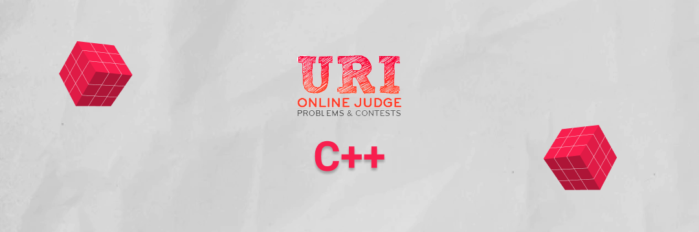

<p align="center">
    <a href="https://github.com/Gustavo-Henrique-br" >
        
    </a>
    <a href="https://github.com/Gustavo-Henrique-br/uri-judge/stargazers"></a>
</p>
<h1 align="center">
    
</h1>

<h4 align="center"> 
	🚧  Em desenvolvimento🚀 🚧
</h4>

<p align="center">
 <a href="#sobre">Sobre</a> •
 <a href="#features">Funcionalidades</a> •
 <a href="#pre-requisites">Pré-requisitos</a> • 
 <a href="#config">Configurando o VSCode</a> • 
 <a href="#executar">Como executar</a> • 
 <a href="#contribute">Contribuir</a> • 
 <a href="#license">Licença</a>
</p>

<h2 id="sobre" align="center">
    💻 Sobre o projeto
</h2>

[URI Judge](https://www.urionlinejudge.com.br/) - uma plataforma online de algoritmos e problemas de programacao.

Esse Repositório é um aglomerado desses problemas :)

---

<h3 id="features" align="center">
    Features
</h3>

* [X] Automacao na criacao de nova solucao
* [X] Automacao interativa

<h3 id="features" align="center">
    :white_check_mark: Done :white_check_mark:
</h3>

* Beginner
    * [X] [Page 1](https://www.urionlinejudge.com.br/judge/en/problems/index/1)
    * [X] [Page 2](https://www.urionlinejudge.com.br/judge/en/problems/index/1?page=2)

<h2 id="pre-requisites" align="center">
    ⚙️ Pré-requisitos
</h2>
Antes de começar, você vai precisar ter em sua máquina as seguintes ferramentas:

- um compilador de c++ (recomendo [gcc](https://gcc.gnu.org/))
- IDE de preferencia (recomendo [Visual Studio Code](https://code.visualstudio.com/))

```bash
$ gcc -v
#Se você nao tiver instalado, siga os seguintes passos:
$ sudo apt-get update
$ sudo apt-get install build-essential gdb
```

<h2 id="config" align="center">
    🛠️ Configurando o vscode
</h2>

- [Linux](https://code.visualstudio.com/docs/cpp/config-linux)
- [Windows](https://code.visualstudio.com/docs/cpp/config-mingw)
- [Mac](https://code.visualstudio.com/docs/cpp/config-clang-mac)
- [WSL](https://code.visualstudio.com/docs/cpp/config-wsl)

 
<h2 id="executar" align="center">
    🎲 Rodando o script
</h2>

*testado apenas em sistemas linux, tente em outros por sua conta e risco*

```bash

# Clone este repositório
$ git clone https://github.com/Gustavo-Henrique-br/uri-judge.git

# Acesse a pasta do projeto no terminal/cmd
$ cd uri-judge

# Rode o script interativo
$ source create.sh

# Ou se quiser ser mais rapido
$ source _create.sh <nome ou numero do problema>

# O 'source' antes abrira o terminal na pasta do projeto criado, 
#    se nao quiser isso utilize o 'bash':
$ bash create.sh
```

---

<h2 id="contribute" align="center">
    💪 Como contribuir para o projeto
</h2>

1. Faça um **fork** do projeto.
2. Crie uma nova branch com as suas alterações: `git checkout -b my-feature`
3. Salve as alterações e crie uma mensagem de commit contando o que você fez: `git commit -m "feature: My new feature"`
4. Envie as suas alterações: `git push origin my-feature`

---

<h2 id="license" align="center">
    📝 Licença
</h2>
Este projeto esta sem licença alguma, sinta-se livre para utilizar.

Feito com ❤️ por Gustavo Henrique

---